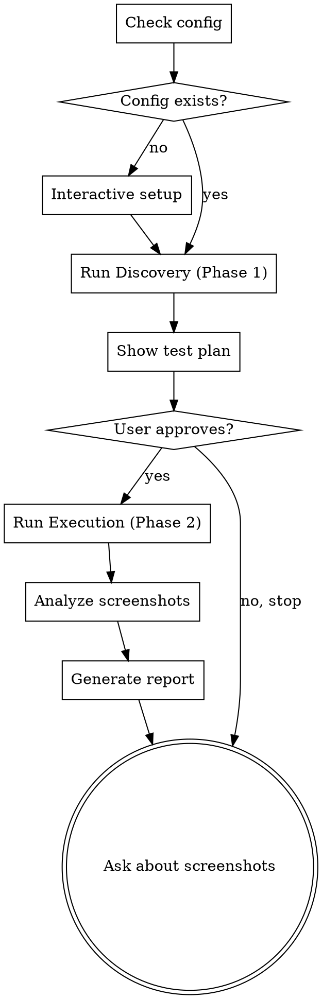

# Visual Testing — Smart Crawler

## Overview

Automated UI testing that behaves like a real user: login → navigate sidebar menu via DFS → click every interactive element → screenshot each state → analyze for bugs → report.

**Zero config.** Only needs `baseUrl` and login credentials.

## When to Use

- After making UI changes across multiple routes
- When AI-generated UI code needs visual verification
- Before a release to check for layout regressions
- When user reports UI bugs and you need a broad sweep

## Prerequisites

- Node.js installed
- Playwright Chromium: `npx playwright install chromium`
- Frontend dev server or staging environment running

## Workflow



### Step 1: Config Setup

Check if `.claude/visual-test.config.json` exists in project root.

**If config does NOT exist**, ask the user:

```
Chua co config visual test. Minh can vai thong tin:

1. URL moi truong test:
   - Local (vd: http://localhost:3000)
   - Staging (vd: https://staging.example.com)

2. Login credentials:
   - Username: ?
   - Password: ?
   - Login path (mac dinh: /login): ?

3. Viewport (mac dinh: 1920x1080) — muon thay doi khong?
```

Create config file:

```json
{
  "baseUrl": "https://staging.example.com",
  "auth": {
    "loginPath": "/login",
    "username": "...",
    "password": "..."
  },
  "viewport": { "width": 1920, "height": 1080 },
  "screenshotDir": "/tmp/visual-test-screenshots",
  "timeouts": {
    "navigation": 15000,
    "element": 5000,
    "retry": 10000
  },
  "limits": {
    "maxPages": 100,
    "maxDuration": 1800000,
    "maxElementsPerPage": 30
  }
}
```

Add `.claude/visual-test.config.json` to `.gitignore`.

**If config exists**, read it and proceed.

### Step 2: Run Discovery (Phase 1)

Write a JSON input file and run the crawler in discovery mode:

```bash
cat > /tmp/visual-test-discovery-input.json << 'ENDJSON'
{
  "mode": "discover",
  "config": { ... full config object ... }
}
ENDJSON

npx tsx .claude/skills/visual-testing/crawler-script.ts /tmp/visual-test-discovery-input.json
```

The script outputs a `TestPlan` JSON to stdout. Parse it.

### Step 3: Show Test Plan & Get Approval

Format the test plan as a markdown table and show to user:

```
| # | Menu Path | URL | Elements | Actions |
|---|-----------|-----|----------|---------|
| 1 | Dashboard | /admin | 3 buttons, 2 tabs | 5 clicks |
| 2 | Products > List | /admin/products/list | 1 create, 3 filters | 5 clicks |
| ... | ... | ... | ... | ... |

Total: X pages, Y elements
Estimated time: ~Z minutes

Proceed? (y/n)
```

If user says no, stop. If yes, continue.

### Step 4: Run Execution (Phase 2)

Write the test plan back to JSON and run execution:

```bash
cat > /tmp/visual-test-execute-input.json << 'ENDJSON'
{
  "mode": "execute",
  "config": { ... full config object ... },
  "testPlan": { ... test plan from Phase 1 ... }
}
ENDJSON

npx tsx .claude/skills/visual-testing/crawler-script.ts /tmp/visual-test-execute-input.json
```

**IMPORTANT:** Always use the file path method for JSON input. Do NOT pipe JSON via `echo` or stdin — shell escaping breaks special characters.

The script:
- Logs progress to stderr in real-time (user sees live output)
- Outputs `ExecutionResult[]` JSON to stdout when complete
- All screenshots saved to `screenshotDir`

### Step 5: Analyze Screenshots

Dispatch parallel subagents to analyze screenshots using `analyze-prompt.md`.

Each subagent receives:
1. A batch of screenshot file paths to read
2. The route info (menuPath, URL, element context)
3. The full `analyze-prompt.md` content

Group screenshots by page for context — subagent should see the page screenshot alongside its element interaction screenshots.

### Step 6: Generate Report

Merge all subagent analysis results into a final report:

```markdown
## Visual Test Report — {date}

### Summary
| Metric | Value |
|--------|-------|
| Pages tested | X/Y |
| Elements clicked | A/B |
| Skipped (by design) | C (D external, E submit) |
| Skipped (error) | F (timeout after retry) |
| Bugs found | G |
| Screenshots taken | H |
| Screenshots with bugs | I |

### CRITICAL (count)
#### 1. {Page} — {description}
- **Page:** {menuPath} ({url})
- **Screenshot:** `{filename}`
- **Trigger:** {what was clicked}
- **Description:** {specific description}

### WARNING (count)
...

### INFO (count)
...

### Execution Log Summary
| # | Menu Path | Status | Duration | Elements | Issues |
|---|-----------|--------|----------|----------|--------|
...

### Failed Elements
| Page | Element | Error | Retried |
|------|---------|-------|---------|
...
```

### Step 7: Screenshot Cleanup

After presenting the report, ask:

```
Da luu {count} screenshots tai {screenshotDir}.

Ban muon:
1. Giu tat ca screenshots
2. Chi xoa screenshots OK (giu {bug_count} bug screenshots)
3. Xoa tat ca screenshots
```

Execute the user's choice.

## Common Mistakes

| Mistake | Fix |
|---------|-----|
| Test user triggers password change | Pre-configure test user |
| Frontend server not running | Start dev server first |
| Playwright not installed | `npx playwright install chromium` |
| Modal won't close | Script tries close button → Escape → force navigate |
| Crawler stuck on one page | Check `crawler.log` in screenshotDir |
| Too many pages | Adjust `limits.maxPages` in config |
| Timeout on slow pages | Increase `timeouts.navigation` in config |
