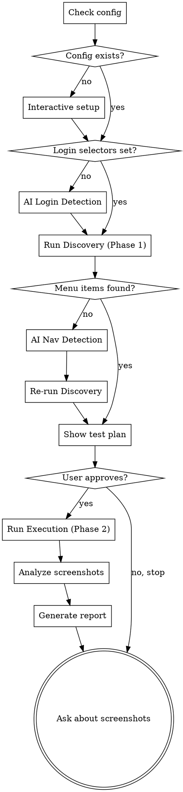

# Visual Testing — Smart Crawler

## Overview

Automated UI testing that behaves like a real user: login → navigate menu via DFS → click every interactive element → screenshot each state → analyze for bugs → report.

**Zero config.** Only needs `baseUrl` and login credentials. Works with any frontend framework — React, Vue, Angular, Laravel, etc. AI automatically detects login form selectors and navigation structure when heuristics fail.

## When to Use

- After making UI changes across multiple routes
- When AI-generated UI code needs visual verification
- Before a release to check for layout regressions
- When user reports UI bugs and you need a broad sweep

## Prerequisites

- Node.js installed
- Playwright Chromium: `npx playwright install chromium`
- Frontend dev server or staging environment running

## Workflow



### Step 1: Config Setup

Check if `.claude/visual-test.config.json` exists in project root.

**If config does NOT exist**, ask the user:

```
Chua co config visual test. Minh can vai thong tin:

1. URL moi truong test:
   - Local (vd: http://localhost:3000)
   - Staging (vd: https://staging.example.com)

2. Login credentials:
   - Username: ?
   - Password: ?
   - Login path (mac dinh: /login): ?

3. Viewport (mac dinh: 1920x1080) — muon thay doi khong?
```

Create config file:

```json
{
  "baseUrl": "https://staging.example.com",
  "auth": {
    "loginPath": "/login",
    "username": "...",
    "password": "..."
  },
  "viewport": { "width": 1920, "height": 1080 },
  "screenshotDir": ".visual-test-screenshots",
  "timeouts": {
    "navigation": 15000,
    "element": 5000,
    "retry": 10000
  },
  "limits": {
    "maxPages": 100,
    "maxDuration": 1800000,
    "maxElementsPerPage": 30
  }
}
```

Add `.claude/visual-test.config.json` and `.visual-test-screenshots/` to `.gitignore`.

**If config exists**, read it and proceed.

### Step 1.5: Login Detection (first run only)

If `auth.usernameSelector` is NOT set in config:

**Phase A: HTML analysis (fast, preferred)**

1. Run crawler in `login-detect-html` mode:

```bash
cat > /tmp/visual-test-login-detect.json << 'ENDJSON'
{ "mode": "login-detect-html", "config": { ... config ... } }
ENDJSON
npx tsx .claude/skills/visual-testing/crawler-script.ts /tmp/visual-test-login-detect.json
```

2. Parse the output JSON — read the `html` field. Analyze the HTML to identify:
   - The username/email input → determine its CSS selector from attributes (type, name, id, placeholder, aria-label)
   - The password input → determine its CSS selector
   - The submit button → determine its CSS selector
   - **Tip:** Watch out for hidden inputs (`hidden`, `type="hidden"`) — skip those and target visible inputs. Use parent class scoping if needed (e.g., `.form-control input[type="email"]`).

3. If you can confidently identify all 3 selectors from HTML, update config and proceed.

**Phase B: Screenshot fallback (only if HTML is ambiguous)**

If the HTML does not clearly reveal the form structure (e.g., custom web components, shadow DOM, heavily dynamic rendering):

1. Run crawler in `login-detect` mode:

```bash
cat > /tmp/visual-test-login-detect.json << 'ENDJSON'
{ "mode": "login-detect", "config": { ... config ... } }
ENDJSON
npx tsx .claude/skills/visual-testing/crawler-script.ts /tmp/visual-test-login-detect.json
```

2. Read the screenshot and visually identify the form elements.

**Update config:**

```json
"auth": {
  "...existing fields...": "...",
  "usernameSelector": "<selector you identified>",
  "passwordSelector": "<selector you identified>",
  "submitSelector": "<selector you identified>"
}
```

Write the updated config to `.claude/visual-test.config.json`.

If you cannot identify the login form from either HTML or screenshot, ask the user.

### Step 2: Run Discovery (Phase 1)

Write a JSON input file and run the crawler in discovery mode:

```bash
cat > /tmp/visual-test-discovery-input.json << 'ENDJSON'
{
  "mode": "discover",
  "config": { ... full config object ... }
}
ENDJSON

npx tsx .claude/skills/visual-testing/crawler-script.ts /tmp/visual-test-discovery-input.json
```

The script outputs a `TestPlan` JSON to stdout. Parse it.

**If discovery returns 0 or very few menu items:**

This often means the app has an intermediate page (master menu, tenant selector, card grid) before the actual admin panel with sidebar navigation. Common pattern: login → master menu (card grid) → click any card → admin panel with sidebar.

**Strategy: Navigate past the intermediate page first.**

1. Run crawler in nav-detect mode:

```bash
cat > /tmp/visual-test-nav-detect.json << 'ENDJSON'
{ "mode": "nav-detect", "config": { ... config ... } }
ENDJSON
npx tsx .claude/skills/visual-testing/crawler-script.ts /tmp/visual-test-nav-detect.json
```

2. Read the screenshot. Identify what you see:

   **Case A — Master menu / card grid / tenant selector:**
   The page shows clickable cards, icons, or links that each lead to a different section of the app. The actual sidebar navigation only appears AFTER clicking one of these cards.

   → Add `postLoginPath` to config: pick the URL path that any card navigates to (e.g., `/admin`). The crawler will navigate there after login, which should reveal the sidebar.

   → If the master menu cards lead to different admin sections with different sidebars, add `masterMenu` config:
   ```json
   "masterMenu": {
     "cardSelector": "<selector for clickable cards/links on master menu>",
     "basePathAfterClick": "/admin"
   }
   ```
   → Re-run discovery. The crawler will now navigate past the master menu.

   **Case B — Sidebar exists but not detected:**
   The page has a sidebar (left/right), top navbar, hamburger menu, or tabs, but the generic heuristics didn't find it.

   → If it's a non-standard sidebar (icon-only, MUI Drawer, etc.), add `sidebar` config:
   ```json
   "sidebar": {
     "iconSelector": "<selector>",
     "submenuItemSelector": "<selector>"
   }
   ```

   **Case C — No navigation visible:**
   → Ask the user for guidance on how to navigate the app.

3. Update config and re-run discovery.

**If discovery returns pages but the count seems too low** (e.g., only 10 pages when you expect 30+), it may mean the sidebar only shows items for one section. Check if the app has a master menu that groups sections. If so, the crawler needs to visit each master menu section separately — add `masterMenu.cardSelector` so the crawler iterates all sections.

### Step 3: Show Test Plan & Get Approval

Format the test plan as a markdown table and show to user:

```
| # | Menu Path | URL | Elements | Actions |
|---|-----------|-----|----------|---------|
| 1 | Dashboard | /admin | 3 buttons, 2 tabs | 5 clicks |
| 2 | Products > List | /admin/products/list | 1 create, 3 filters | 5 clicks |
| ... | ... | ... | ... | ... |

Total: X pages, Y elements
Estimated time: ~Z minutes

Proceed? (y/n)
```

If user says no, stop. If yes, continue.

### Step 4: Run Execution (Phase 2)

Write the test plan back to JSON and run execution:

```bash
cat > /tmp/visual-test-execute-input.json << 'ENDJSON'
{
  "mode": "execute",
  "config": { ... full config object ... },
  "testPlan": { ... test plan from Phase 1 ... }
}
ENDJSON

npx tsx .claude/skills/visual-testing/crawler-script.ts /tmp/visual-test-execute-input.json
```

**IMPORTANT:** Always use the file path method for JSON input. Do NOT pipe JSON via `echo` or stdin — shell escaping breaks special characters.

The script:
- Logs progress to stderr in real-time (user sees live output)
- Outputs `ExecutionResult[]` JSON to stdout when complete
- All screenshots saved to `screenshotDir`

### Step 5: Analyze Screenshots

Dispatch parallel subagents to analyze screenshots using `analyze-prompt.md`.

Each subagent receives:
1. A batch of screenshot file paths to read
2. The route info (menuPath, URL, element context)
3. The full `analyze-prompt.md` content

Group screenshots by page for context — subagent should see the page screenshot alongside its element interaction screenshots.

### Step 6: Generate Report

Merge all subagent analysis results into a final report:

```markdown
## Visual Test Report — {date}

### Summary
| Metric | Value |
|--------|-------|
| Pages tested | X/Y |
| Elements clicked | A/B |
| Skipped (by design) | C (D external, E submit) |
| Skipped (error) | F (timeout after retry) |
| Bugs found | G |
| Screenshots taken | H |
| Screenshots with bugs | I |

### CRITICAL (count)
#### 1. {Page} — {description}
- **Page:** {menuPath} ({url})
- **Screenshot:** `{filename}`
- **Trigger:** {what was clicked}
- **Description:** {specific description}

### WARNING (count)
...

### INFO (count)
...

### Execution Log Summary
| # | Menu Path | Status | Duration | Elements | Issues |
|---|-----------|--------|----------|----------|--------|
...

### Failed Elements
| Page | Element | Error | Retried |
|------|---------|-------|---------|
...
```

### Step 7: Screenshot Cleanup

After presenting the report, ask:

```
Da luu {count} screenshots tai {screenshotDir}.

Ban muon:
1. Giu tat ca screenshots
2. Chi xoa screenshots OK (giu {bug_count} bug screenshots)
3. Xoa tat ca screenshots
```

Execute the user's choice.

## Common Mistakes

| Mistake | Fix |
|---------|-----|
| Test user triggers password change | Pre-configure test user |
| Frontend server not running | Start dev server first |
| Playwright not installed | `npx playwright install chromium` |
| Modal won't close | Script tries close button → Escape → force navigate |
| Crawler stuck on one page | Check `crawler.log` in screenshotDir |
| Too many pages | Adjust `limits.maxPages` in config |
| Timeout on slow pages | Increase `timeouts.navigation` in config |
